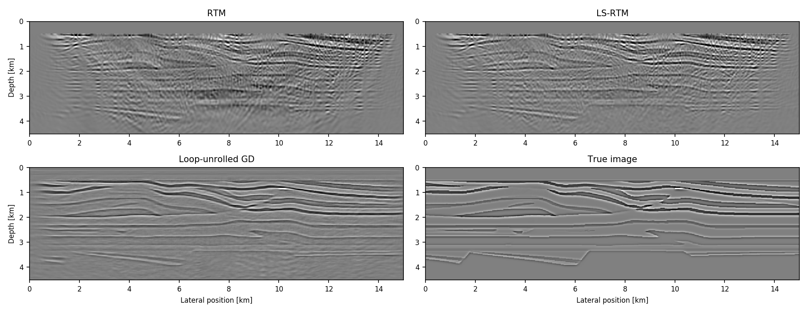

# The Julia Devito Inversion framework (JUDI)

[](https://slimgroup.github.io/JUDI.jl/) 
[](https://github.com/slimgroup/JUDI.jl/actions?query=workflow%3ACI-tests)
[](https://doi.org/10.5281/zenodo.3878711)
[](https://codecov.io/gh/slimgroup/JUDI.jl)

## Overview

JUDI is a framework for large-scale seismic modeling and inversion and designed to enable rapid translations of algorithms to fast and efficient code that scales to industry-size 3D problems. The focus of the package lies on seismic modeling as well as PDE-constrained optimization such as full-waveform inversion (FWI) and imaging (LS-RTM). Wave equations in JUDI are solved with [Devito](https://www.devitoproject.org), a Python domain-specific language for automated finite-difference (FD) computations. JUDI's modeling operators can also be used as layers in (convolutional) neural networks to implement physics-augmented deep learning algorithms. For this, check out JUDI's deep learning extension [JUDI4Flux](https://github.com/slimgroup/JUDI4Flux.jl).

## FAQ

You can find an FAQ with answers to issues at [FAQ](https://github.com/slimgroup/JUDI.jl/wiki/FAQ)

## Installation and prerequisites

You can find installation instruction in our Wiki at [Installation](https://github.com/slimgroup/JUDI.jl/wiki/Installation)

## Running with Docker

If you do not want to install JUDI, you can run JUDI as a docker image. The first possibility is to run the docker container as a Jupyter notebook:

```
docker run -p 8888:8888 philippwitte/judi:v1.5
```

This command downloads the image and launches a container. You will see a link that you can copy-past to your browser to access the notebooks. Alternatively, you can run a bash session, in which you can start a regular interactive Julia session and run the example scripts. Download/start the container as a bash session with:

```
docker run -it philippwitte/judi:v1.5 /bin/bash
```

Inside the container, all examples are located in the directory `/app/judi/examples/scripts`.

## Testing

A complete test suite is inculded with JUDI and is tested via GitHub Actions. You can also run the test locally
via:

```julia
    julia --project -e 'using Pkg;Pkg.test(coverage=false)'
```

By default, only the JUDI base API will be tested, however the testing suite supports other modes controlled via the environemnt variable `GROUP` such as:

```julia
	GROUP=JUDI julia --project -e 'using Pkg;Pkg.test(coverage=false)'
```

The supported modes are:

- JUDI : Only the base API (linear operators, vectors, ...)
- ISO_OP : Isotropic acoustic operators
- ISO_OP_FS : Isotropic acoustic operators with free surface
- TTI_OP : Transverse tilted isotropic operators
- TTI_OP_FS : Transverse tilted isotropic operators with free surface
- filename : you can also provide just a filename (i.e `GROUP=test_judiVector.jl`) and only this one test file will be run. Single files with TTI or free surface are not currently supported as it relies on `Base.ARGS` for the setup.


## Configure compiler and OpenMP

Devito uses just-in-time compilation for the underlying wave equation solves. The default compiler is intel, but can be changed to any other specified compiler such as `gnu`. Either run the following command from the command line or add it to your ~/.bashrc file:

```
export DEVITO_ARCH=gnu
```

Devito uses shared memory OpenMP parallelism for solving PDEs. OpenMP is disabled by default, but you can enable OpenMP and define the number of threads (per PDE solve) as follows:

```
export DEVITO_LANGUAGE=openmp  # Enable OpenMP. 
export OMP_NUM_THREADS=4    # Number of OpenMP threads
```

## Full-waveform inversion

JUDI is designed to let you set up objective functions that can be passed to standard packages for (gradient-based) optimization. The following example demonstrates how to perform FWI on the 2D Overthrust model using a spectral projected gradient algorithm from the minConf library, which is included in the software. A small test dataset (62 MB) and the model can be downloaded from this FTP server:

```julia
run(`wget ftp://slim.gatech.edu/data/SoftwareRelease/WaveformInversion.jl/2DFWI/overthrust_2D.segy`)
run(`wget ftp://slim.gatech.edu/data/SoftwareRelease/WaveformInversion.jl/2DFWI/overthrust_2D_initial_model.h5`)
```

The first step is to load the velocity model and the observed data into Julia, as well as setting up bound constraints for the inversion, which prevent too high or low velocities in the final result. Furthermore, we define an 8 Hertz Ricker wavelet as the source function:

```julia
using PyPlot, HDF5, SegyIO, JUDI, JUDI.TimeModeling.SLIM_optim, Statistics, Random

# Load starting model
n, d, o, m0 = read(h5open("overthrust_2D_initial_model.h5", "r"), "n", "d", "o", "m0")
model0 = Model((n[1], n[2]), (d[1], d[2]), (o[1], o[2]), m0)	# need n, d, o as tuples and m0 as array

# Bound constraints
vmin = ones(Float32, model0.n) .+ 0.3f0
vmax = ones(Float32, model0.n) .+ 5.5f0
mmin = vec((1f0 ./ vmax).^2)	# convert to slowness squared [s^2/km^2]
mmax = vec((1f0 ./ vmin).^2)

# Load segy data
block = segy_read("overthrust_2D.segy")
dobs = judiVector(block)

# Set up wavelet
src_geometry = Geometry(block; key="source", segy_depth_key="SourceDepth")	# read source position geometry
wavelet = ricker_wavelet(src_geometry.t[1], src_geometry.dt[1], 0.008f0)	# 8 Hz wavelet
q = judiVector(src_geometry, wavelet)

```

For this FWI example, we define an objective function that can be passed to the minConf optimization library, which is included in the Julia Devito software package. We allow a maximum of 20 function evaluations using a spectral-projected gradient (SPG) algorithm. To save computational cost, each function evaluation uses a randomized subset of 20 shot records, instead of all 97 shots:

```julia
# Optimization parameters
fevals = 20	# number of function evaluations
batchsize = 20	# number of sources per iteration
fvals = zeros(21)
opt = Options(optimal_checkpointing = false)    # set to true to enable checkpointing

# Objective function for minConf library
count = 0
function objective_function(x)
	model0.m = reshape(x, model0.n);

	# fwi function value and gradient
	i = randperm(dobs.nsrc)[1:batchsize]
	fval, grad = fwi_objective(model0, q[i], dobs[i]; options=opt)
	grad = reshape(grad, model0.n); grad[:, 1:21] .= 0f0	# reset gradient in water column to 0.
	grad = .1f0*grad/maximum(abs.(grad))	# scale gradient for line search

	global count; count += 1; fvals[count] = fval
    return fval, vec(grad.data)
end

# FWI with SPG
ProjBound(x) = median([mmin x mmax], dims=2)	# Bound projection
options = spg_options(verbose=3, maxIter=fevals, memory=3)
x, fsave, funEvals= minConf_SPG(objective_function, vec(m0), ProjBound, options)
```

This example script can be run in parallel and requires roughly 220 MB of memory per source location. Execute the following code to generate figures of the initial model and the result, as well as the function values:

```julia
figure(); imshow(sqrt.(1./adjoint(m0))); title("Initial model")
figure(); imshow(sqrt.(1./adjoint(reshape(x, model0.n)))); title("FWI")
figure(); plot(fvals); title("Function value")
```


## Least squares reverse-time migration

JUDI includes matrix-free linear operators for modeling and linearized (Born) modeling, that let you write algorithms for migration that follow the mathematical notation of standard least squares problems. This example demonstrates how to use Julia Devito to perform least-squares reverse-time migration on the 2D Marmousi model. Start by downloading the test data set (1.1 GB) and the model:

```julia
run(`wget ftp://slim.gatech.edu/data/SoftwareRelease/Imaging.jl/2DLSRTM/marmousi_2D.segy`)
run(`wget ftp://slim.gatech.edu/data/SoftwareRelease/Imaging.jl/2DLSRTM/marmousi_migration_velocity.h5`)
```

Once again, load the starting model and the data and set up the source wavelet. For this example, we use a Ricker wavelet with 30 Hertz peak frequency. For setting up matrix-free linear operators, an `info` structure with the dimensions of the problem is required:

```julia
using PyPlot, HDF5, JUDI, SegyIO, Random

# Load smooth migration velocity model
n,d,o,m0 = read(h5open("marmousi_migration_velocity.h5","r"), "n", "d", "o", "m0")
model0 = Model((n[1],n[2]), (d[1],d[2]), (o[1],o[2]), m0)

# Load data
block = segy_read("marmousi_2D.segy")
dD = judiVector(block)

# Set up wavelet
src_geometry = Geometry(block; key="source", segy_depth_key="SourceDepth")
wavelet = ricker_wavelet(src_geometry.t[1],src_geometry.dt[1],0.03)	# 30 Hz wavelet
q = judiVector(src_geometry,wavelet)

# Set up info structure
ntComp = get_computational_nt(q.geometry,dD.geometry,model0)	# no. of computational time steps
info = Info(prod(model0.n),dD.nsrc,ntComp)
```

To speed up the convergence of our imaging example, we set up a basic preconditioner for each the model- and the data space, consisting of mutes to suppress the ocean-bottom reflection in the data and the source/receiver imprint in the image. The operator `J` represents the linearized modeling operator and its adjoint `J'` corresponds to the migration (RTM) operator. The forward and adjoint pair can be used for a basic LS-RTM example with (stochastic) gradient descent:

```julia
# Set up matrix-free linear operators
opt = Options(optimal_checkpointing = true)    # set to false to disable optimal checkpointing
F = judiModeling(info, model0, q.geometry, dD.geometry; options=opt)
J = judiJacobian(F, q)

# Right-hand preconditioners (model topmute)
Mr = judiTopmute(model0.n, 52, 10)	# mute up to grid point 52, with 10 point taper

# Stochastic gradient
x = zeros(Float32, info.n)	# zero initial guess
batchsize = 10	# use subset of 10 shots per iteration
niter = 32
fval = zeros(Float32, niter)

for j=1:niter
	println("Iteration: ", j)

	# Select batch and set up left-hand preconditioner
	i = randperm(dD.nsrc)[1:batchsize]
	Ml = judiMarineTopmute2D(30, dD[i].geometry)	# data topmute starting at time sample 30

	# Compute residual and gradient
	r = Ml*J[i]*Mr*x - Ml*dD[i]
	g = adjoint(Mr)*adjoint(J[i])*adjoint(Ml)*r

	# Step size and update variable
	fval[j] = .5f0*norm(r)^2
	t = norm(r)^2/norm(g)^2
	global x -= t*g
end
```


## Machine Learning

The JUDI4Flux interface allows integrating JUDI modeling operators into convolutional neural networks for deep learning. For example, the following code snippet shows how to create a shallow CNN consisting of two convolutional layers with a nonlinear forward modeling layer in-between them. JUDI4Flux enables backpropagation through Flux' automatic differentiation tool, but calls the corresponding adjoint JUDI operators under the hood. For more details, please check out the [JUDI4Flux Github](https://github.com/slimgroup/JUDI4Flux.jl) page.

```julia
# Jacobian
W1 = judiJacobian(F0, q)
b1 = randn(Float32, num_samples)

# Fully connected layer
W2 = randn(Float32, n_out, num_samples)
b2 = randn(Float32, n_out)

# Network and loss
network(x) = W2*(W1*x .+ b1) .+ b2
loss(x, y) = Flux.mse(network(x), y)

# Compute gradient w/ Flux
p = params(x, y, W1, b1, b2)
gs = Tracker.gradient(() -> loss(x, y), p)
gs[x]	# gradient w.r.t. to x
```

JUDI4Flux allows implementing physics-augmented neural networks for seismic inversion, such as loop-unrolled seismic imaging algorithms. For example, the following results are a conventional RTM image, an LS-RTM image and a loop-unrolled LS-RTM image for a single simultaneous shot record.



## Authors

This package was written by [Philipp Witte](https://www.slim.eos.ubc.ca/philip) and [Mathias Louboutin](https://www.slim.eos.ubc.ca/content/mathias-louboutin) from the Seismic Laboratory for Imaging and Modeling (SLIM) at the Georgia Institute of Technology.

If you use our software for your research, please cite our [Geophysics paper](https://library.seg.org/doi/abs/10.1190/geo2018-0174.1#):

```
@article{witteJUDI2019,
author = {Philipp A. Witte and Mathias Louboutin and Navjot Kukreja and Fabio Luporini and Michael Lange and Gerard J. Gorman and Felix J. Herrmann},
title = {A large-scale framework for symbolic implementations of seismic inversion algorithms in Julia},
journal = {GEOPHYSICS},
volume = {84},
number = {3},
pages = {F57-F71},
year = {2019},
doi = {10.1190/geo2018-0174.1},
URL = {https://doi.org/10.1190/geo2018-0174.1},
eprint = {https://doi.org/10.1190/geo2018-0174.1}
}
```

Also visit the Devito homepage at <https://www.devitoproject.org/publications> for more information and references.

Contact authors via: pwitte3@gatech.edu and mlouboutin3@gatech.edu.
