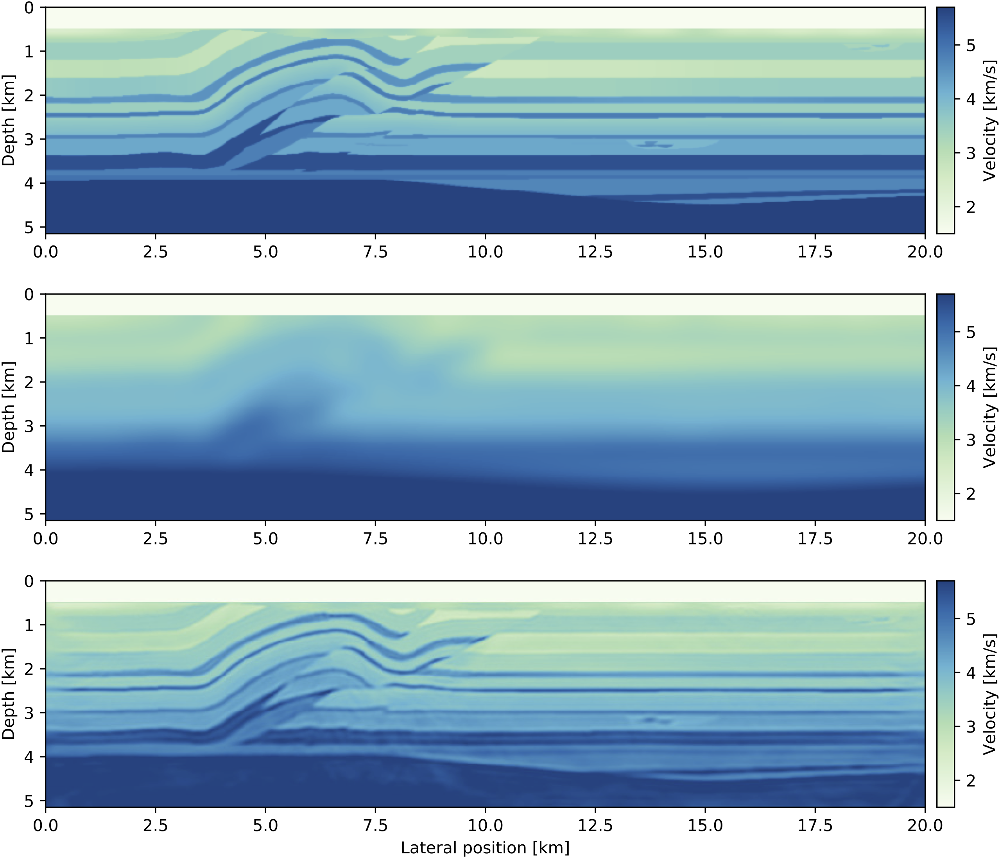

# Seismic Inversion

```@contents
Pages = ["inversion.md"]
```

## Introduction

We currently introduced the linear operators that allow to write seismic modeling and inversion in a high-level, linear algebra way. These linear operator allow the script to closely follow the mathematics and to be readable and understandable.

However, these come with overhead. In particular, consider the following compuation on the FWI gradient:

```julia

d_syn = F*q
r = judiJacobian(F, q)' * (d_syn - d_obs)
```

In this two lines, the forward modeling is performed twice: once to compute `d_syn` then once again to compute the Jacobian adjoint. In order to avoid this overhead for practical inversion, we provide utility function that directly comput the gradient and objective function (L2- misfit) of FWI, LSRTM and TWRI with minimum overhead.

## FWI

```@docs
fwi_objective
```

### Example

JUDI is designed to let you set up objective functions that can be passed to standard packages for (gradient-based) optimization. The following example demonstrates how to perform FWI on the 2D Overthrust model using a spectral projected gradient algorithm from the minConf library, which is included in the software. A small test dataset (62 MB) and the model can be downloaded from this FTP server:

```julia
run(`wget ftp://slim.gatech.edu/data/SoftwareRelease/WaveformInversion.jl/2DFWI/overthrust_2D.segy`)
run(`wget ftp://slim.gatech.edu/data/SoftwareRelease/WaveformInversion.jl/2DFWI/overthrust_2D_initial_model.h5`)
```

The first step is to load the velocity model and the observed data into Julia, as well as setting up bound constraints for the inversion, which prevent too high or low velocities in the final result. Furthermore, we define an 8 Hertz Ricker wavelet as the source function:

```julia
using PythonPlot, HDF5, SegyIO, JUDI, SlimOptim, Statistics, Random

# Load starting model
n, d, o, m0 = read(h5open("overthrust_2D_initial_model.h5", "r"), "n", "d", "o", "m0")
model0 = Model((n[1], n[2]), (d[1], d[2]), (o[1], o[2]), m0)	# need n, d, o as tuples and m0 as array

# Bound constraints
vmin = ones(Float32, model0.n) .+ 0.3f0
vmax = ones(Float32, model0.n) .+ 5.5f0
mmin = vec((1f0 ./ vmax).^2)	# convert to slowness squared [s^2/km^2]
mmax = vec((1f0 ./ vmin).^2)

# Load segy data
block = segy_read("overthrust_2D.segy")
dobs = judiVector(block)

# Set up wavelet
src_geometry = Geometry(block; key="source", segy_depth_key="SourceDepth")	# read source position geometry
wavelet = ricker_wavelet(src_geometry.t[1], src_geometry.dt[1], 0.008f0)	# 8 Hz wavelet
q = judiVector(src_geometry, wavelet)

```

For this FWI example, we define an objective function that can be passed to the minConf optimization library, which is included in the Julia Devito software package. We allow a maximum of 20 function evaluations using a spectral-projected gradient (SPG) algorithm. To save computational cost, each function evaluation uses a randomized subset of 20 shot records, instead of all 97 shots:

```julia
# Optimization parameters
fevals = 20	# number of function evaluations
batchsize = 20	# number of sources per iteration
fvals = zeros(21)
opt = Options(optimal_checkpointing = false)    # set to true to enable checkpointing

# Objective function for minConf library
count = 0
function objective_function(x)
	model0.m = reshape(x, model0.n);

	# fwi function value and gradient
	i = randperm(dobs.nsrc)[1:batchsize]
	fval, grad = fwi_objective(model0, q[i], dobs[i]; options=opt)
	grad = reshape(grad, model0.n); grad[:, 1:21] .= 0f0	# reset gradient in water column to 0.
	grad = .1f0*grad/maximum(abs.(grad))	# scale gradient for line search

	global count; count += 1; fvals[count] = fval
    return fval, vec(grad.data)
end

# FWI with SPG
ProjBound(x) = median([mmin x mmax], dims=2)	# Bound projection
options = spg_options(verbose=3, maxIter=fevals, memory=3)
res = spg(objective_function, vec(m0), ProjBound, options)
```

This example script can be run in parallel and requires roughly 220 MB of memory per source location. Execute the following code to generate figures of the initial model and the result, as well as the function values:

```julia
figure(); imshow(sqrt.(1. /adjoint(m0))); title("Initial model")
figure(); imshow(sqrt.(1. /adjoint(reshape(x, model0.n)))); title("FWI")
figure(); plot(fvals); title("Function value")
```




## LSRTM

```@docs
lsrtm_objective
```

### Example

JUDI includes matrix-free linear operators for modeling and linearized (Born) modeling, that let you write algorithms for migration that follow the mathematical notation of standard least squares problems. This example demonstrates how to use Julia Devito to perform least-squares reverse-time migration on the 2D Marmousi model. Start by downloading the test data set (1.1 GB) and the model:

```julia
run(`wget ftp://slim.gatech.edu/data/SoftwareRelease/Imaging.jl/2DLSRTM/marmousi_2D.segy`)
run(`wget ftp://slim.gatech.edu/data/SoftwareRelease/Imaging.jl/2DLSRTM/marmousi_migration_velocity.h5`)
```

Once again, load the starting model and the data and set up the source wavelet. For this example, we use a Ricker wavelet with 30 Hertz peak frequency.

```julia
using PythonPlot, HDF5, JUDI, SegyIO, Random

# Load smooth migration velocity model
n,d,o,m0 = read(h5open("marmousi_migration_velocity.h5","r"), "n", "d", "o", "m0")
model0 = Model((n[1],n[2]), (d[1],d[2]), (o[1],o[2]), m0)

# Load data
block = segy_read("marmousi_2D.segy")
dD = judiVector(block)

# Set up wavelet
src_geometry = Geometry(block; key="source", segy_depth_key="SourceDepth")
wavelet = ricker_wavelet(src_geometry.t[1],src_geometry.dt[1],0.03)	# 30 Hz wavelet
q = judiVector(src_geometry,wavelet)

# Set up info structure
ntComp = get_computational_nt(q.geometry,dD.geometry,model0)	# no. of computational time steps
info = Info(prod(model0.n),dD.nsrc,ntComp)
```

To speed up the convergence of our imaging example, we set up a basic preconditioner for each the model- and the data space, consisting of mutes to suppress the ocean-bottom reflection in the data and the source/receiver imprint in the image. The operator `J` represents the linearized modeling operator and its adjoint `J'` corresponds to the migration (RTM) operator. The forward and adjoint pair can be used for a basic LS-RTM example with (stochastic) gradient descent:

```julia
# Set up matrix-free linear operators
opt = Options(optimal_checkpointing = true)    # set to false to disable optimal checkpointing
F = judiModeling(model0, q.geometry, dD.geometry; options=opt)
J = judiJacobian(F, q)

# Right-hand preconditioners (model topmute)
Mr = judiTopmute(model0; taperwidth=10)	# mute up to grid point 52, with 10 point taper
# Left-hand side preconditioners
Ml = judiDatMute(q.geometry, dD.geometry; t0=.120)	# data topmute starting at time 120ms

# Stochastic gradient
x = zeros(Float32, info.n)	# zero initial guess
batchsize = 10	# use subset of 10 shots per iteration
niter = 32
fval = zeros(Float32, niter)

for j=1:niter
	println("Iteration: ", j)

	# Select batch and set up left-hand preconditioner
	i = randperm(dD.nsrc)[1:batchsize]

	# Compute residual and gradient
	r = Ml[i]*J[i]*Mr*x - Ml[i]*dD[i]
	g = adjoint(Mr)*adjoint(J[i])*adjoint(Ml[i])*r

	# Step size and update variable
	fval[j] = .5f0*norm(r)^2
	t = norm(r)^2/norm(g)^2
	global x -= t*g
end
```


## TWRI

```@docs
twri_objective
```

and related TWRI options

```@docs
TWRIOptions
```


## Machine Learning

[ChainRules.jl](https://github.com/JuliaDiff/ChainRules.jl) allows integrating JUDI modeling operators into convolutional neural networks for deep learning. For example, the following code snippet shows how to create a shallow CNN consisting of two convolutional layers with a nonlinear forward modeling layer in-between them. The integration of ChainRules and JUDI enables backpropagation through Flux' automatic differentiation tool, but calls the corresponding adjoint JUDI operators under the hood. For more details, please check out [this tutorial](https://github.com/slimgroup/JUDI.jl/blob/master/examples/notebooks/06_automatic_differentiation.ipynb).

```julia
# Jacobian
W1 = judiJacobian(F0, q)
b1 = randn(Float32, num_samples)

# Fully connected layer
W2 = randn(Float32, n_out, num_samples)
b2 = randn(Float32, n_out)

# Network and loss
network(x) = W2*(W1*x .+ b1) .+ b2
loss(x, y) = Flux.mse(network(x), y)

# Compute gradient w/ Flux
p = params(x, y, W1, b1, b2)
gs = Tracker.gradient(() -> loss(x, y), p)
gs[x]	# gradient w.r.t. to x
```

Integration with ChainRules allows implementing physics-augmented neural networks for seismic inversion, such as loop-unrolled seismic imaging algorithms. For example, the following results are a conventional RTM image, an LS-RTM image and a loop-unrolled LS-RTM image for a single simultaneous shot record.

