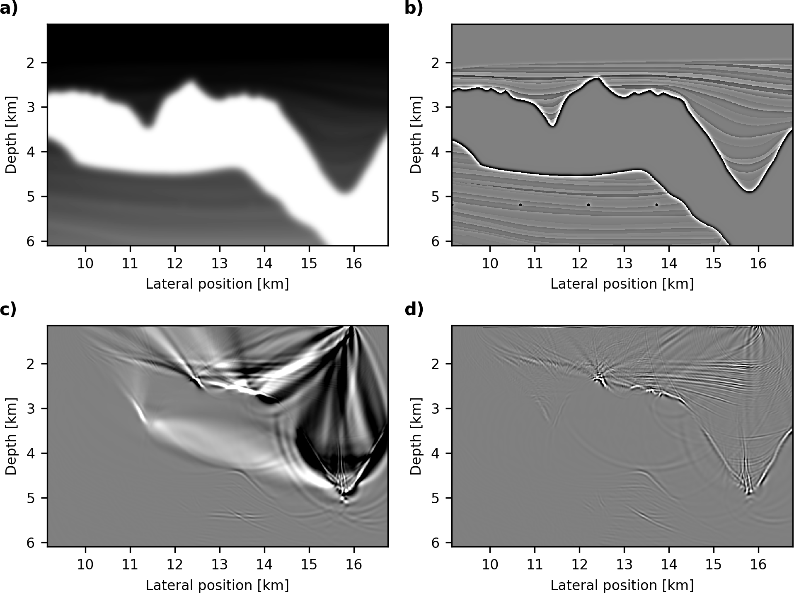
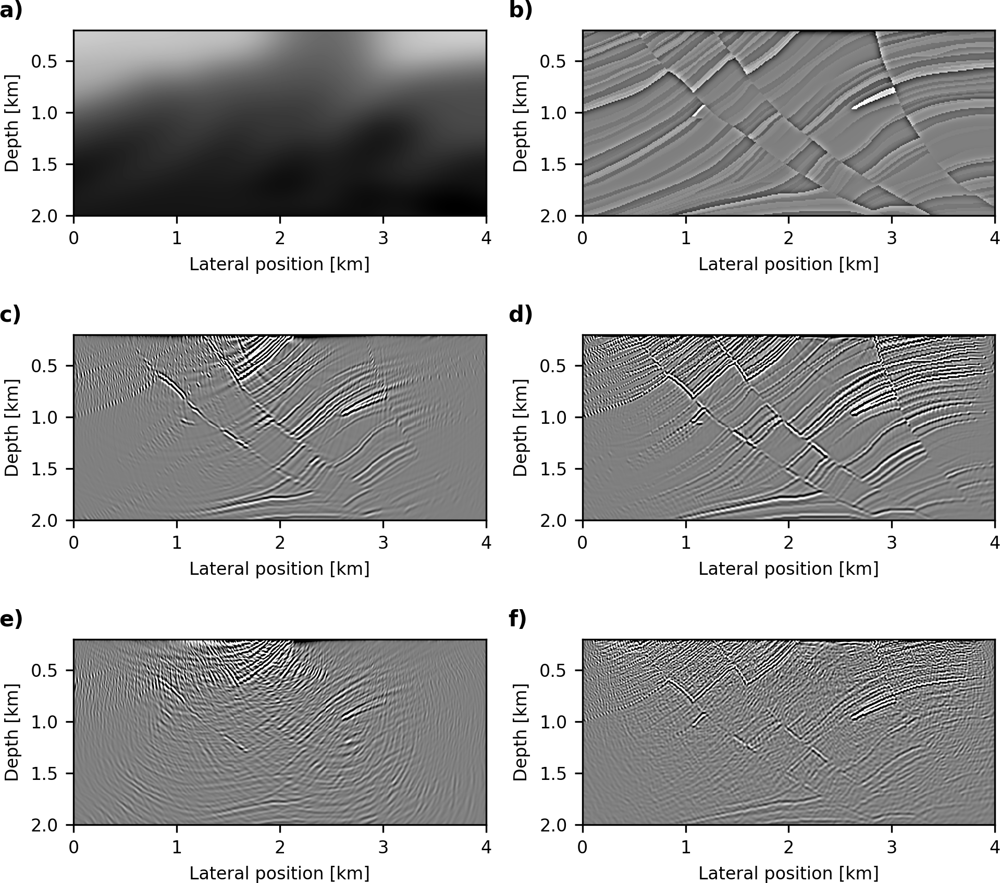
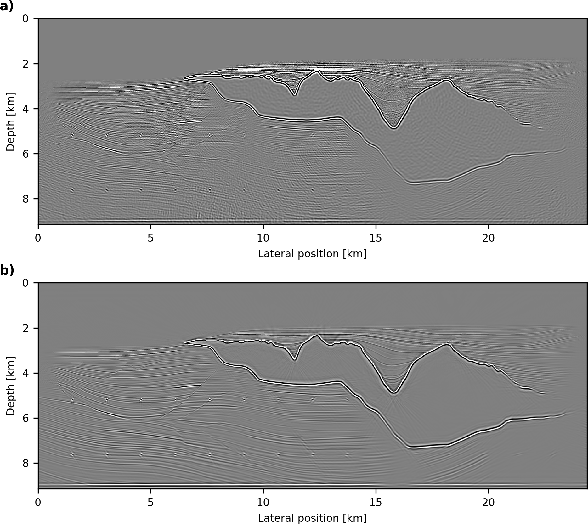
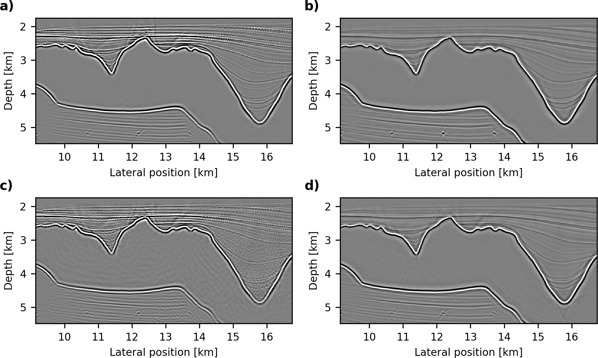
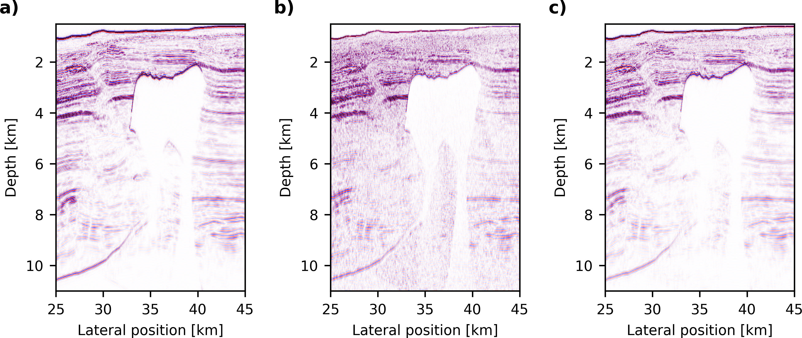

# Compressive least squares migration with on-the-fly Fourier transforms

## Overview

This repository contains instructions and the scripts to reproduce the examples from the paper ["Compressive least squares migration with on-the-fly Fourier transforms" (Witte et al, 2019)](https://library.seg.org/doi/abs/10.1190/geo2018-0490.1). Running the examples requires Julia (version 1.1.0) and the JUDI package. Follow the instructions from the [main page](https://github.com/slimgroup/JUDI.jl) to install JUDI and its required packages. For questions, contact Philipp Witte at pwitte3@gatech.edu.

## Abstract

Least-squares seismic imaging is an inversion-based approach for accurately imaging the earth's subsurface. However, in the time-domain, the computational cost and memory requirements of this approach scale with the size and recording length of the seismic experiment, thus making this approach often prohibitively expensive in practice. To overcome these issues, we borrow ideas from compressive sensing and signal processing and introduce an algorithm for sparsity-promoting seismic imaging using on-the-fly Fourier transforms. By computing gradients and functions values for random subsets of source locations and frequencies, we considerably limit the number of wave equation solves, while on-the-fly Fourier transforms allow computing an arbitrary number of monochromatic frequency-domain wavefields with a time-domain modeling code and without having to solve large-scale Helmholtz equations. The memory requirements of this approach are independent of the number of time steps and solely depend on the number of frequencies, which determine the amount of crosstalk and subsampling artifacts in the image. We show the application of our approach to several large-scale open source data sets and compare the results to a conventional time-domain approach with optimal checkpointing.


## Obtaining the velocity models

The velocity models for our example (Sigsbee 2A and BP 2004 Synthetic model) are available on the SLIM ftp server. Follow [the link](ftp://slim.gatech.edu/data/SoftwareRelease/Imaging.jl/CompressiveLSRTM/) or run the following command from the terminal to download the velocity models and supplementary files:


### Sigsbee 2A

```
wget ftp://slim.gatech.edu/data/SoftwareRelease/Imaging.jl/CompressiveLSRTM/sigsbee2A_model.jld
```

### BP Synthetic 2004

Generating the observed data requires the true velocity model, as well as the density model. Furthermore, we need the header geometry, which was extracted from the [original data](https://wiki.seg.org/wiki/2004_BP_velocity_estimation_benchmark_model) released by BP and saved as a Julia file.

```
wget ftp://slim.gatech.edu/data/SoftwareRelease/Imaging.jl/CompressiveLSRTM/bp_synthetic_2004_true_velocity.jld
wget ftp://slim.gatech.edu/data/SoftwareRelease/Imaging.jl/CompressiveLSRTM/bp_synthetic_2004_density.jld
wget ftp://slim.gatech.edu/data/SoftwareRelease/Imaging.jl/CompressiveLSRTM/bp_synthetic_2004_header_geometry.jld
```

For running the RTM and SPLS-RTM examples, we need the migration velocity model, which is a slightyl smoothed version of the true velocity. Furthermore, we use a mask to zero out the water column.

```
wget ftp://slim.gatech.edu/data/SoftwareRelease/Imaging.jl/CompressiveLSRTM/bp_synthetic_2004_migration_velocity.jld
wget ftp://slim.gatech.edu/data/SoftwareRelease/Imaging.jl/CompressiveLSRTM/bp_synthetic_2004_water_bottom.jld
```


## The linearized inverse scattering imaging condition

To reproduce Figure 1 from the paper, run the script [compare_imaging_conditions.jl](https://github.com/slimgroup/JUDI.jl/blob/master/examples/compressive_splsrtm/Figure1/compare_imaging_conditions.jl). Forward and adjoint linearized modeling using on-the-fly DFTs with the two different imaging conditions is implemented using [Devito](https://github.com/opesci/devito). The linearized wave equations are set up as symbolic python objects and are defined in the JUDI source code. Follow [this link](https://github.com/slimgroup/JUDI.jl/blob/master/src/Python/JAcoustic_codegen.py) to see the implementations of the operators.

#### Figure: {#f1}
{width=80%}

## Time vs frequency domain imaging

To reproduce Figure 2 from the paper, run the script [compare_imaging_time_frequency.jl](https://github.com/slimgroup/JUDI.jl/blob/master/examples/compressive_splsrtm/Figure2/compare_imaging_time_frequency.jl).

#### Figure: {#f2}
{width=80%}

## Sigsbee 2A example

First generate the observed (linearized) data by running the [generate_data_sigsbee.jl](https://github.com/slimgroup/JUDI.jl/blob/master/examples/compressive_splsrtm/Sigsbee2A/generate_data_sigsbee.jl) script. The RTM results can be reproduced using the [rtm_sigsbee.jl](https://github.com/slimgroup/JUDI.jl/blob/master/examples/compressive_splsrtm/Sigsbee2A/rtm_sigsbee.jl) script. The time and frequency-domain SPLS-RTM results can be reproduced with the scripts [splsrtm_sigsbee_time_domain.jl](https://github.com/slimgroup/JUDI.jl/blob/master/examples/compressive_splsrtm/Sigsbee2A/splsrtm_sigsbee_time_domain.jl) and [splsrtm_sigsbee_frequency_domain.jl](https://github.com/slimgroup/JUDI.jl/blob/master/examples/compressive_splsrtm/Sigsbee2A/splsrtm_sigsbee_frequency_domain.jl).

#### Figure: {#f3}
{width=80%}

#### Figure: {#f4}
{width=80%}


## BP Synthetic 2004 example

First, we generate the observed (non-linear) data using the true velocity model and the density. The data can be generated by running the script [generate_data_bp2004.jl](https://github.com/slimgroup/JUDI.jl/blob/master/examples/compressive_splsrtm/BP_synthetic_2004/generate_data_bp2004.jl). The scripts [rtm_bp_2004_freq.jl](https://github.com/slimgroup/JUDI.jl/blob/master/examples/compressive_splsrtm/BP_synthetic_2004/rtm_bp_2004_freq.jl) and [splsrtm_bp_2004_freq.jl](https://github.com/slimgroup/JUDI.jl/blob/master/examples/compressive_splsrtm/BP_synthetic_2004/splsrtm_bp_2004_freq.jl) reproduce the frequency-domain RTM and SPLS-RTM results.

#### Figure: {#f5}
{width=80%}

#### Figure: {#f6}
{width=80%}


## References

The reproducible examples on this page are featured in the following journal publication:

 * Philipp A. Witte, Mathias Louboutin, Fabio Luporini, Gerard J. Gorman and Felix J. Herrmann. Compressive least-squares migration with on-the-fly Fourier transforms. GEOPHYSICS. 2019. Just-Accepted-Articles. <https://library.seg.org/doi/abs/10.1190/geo2018-0490.1>

Contact authors via: pwitte3@gatech.edu and mlouboutin3@gatech.edu.
