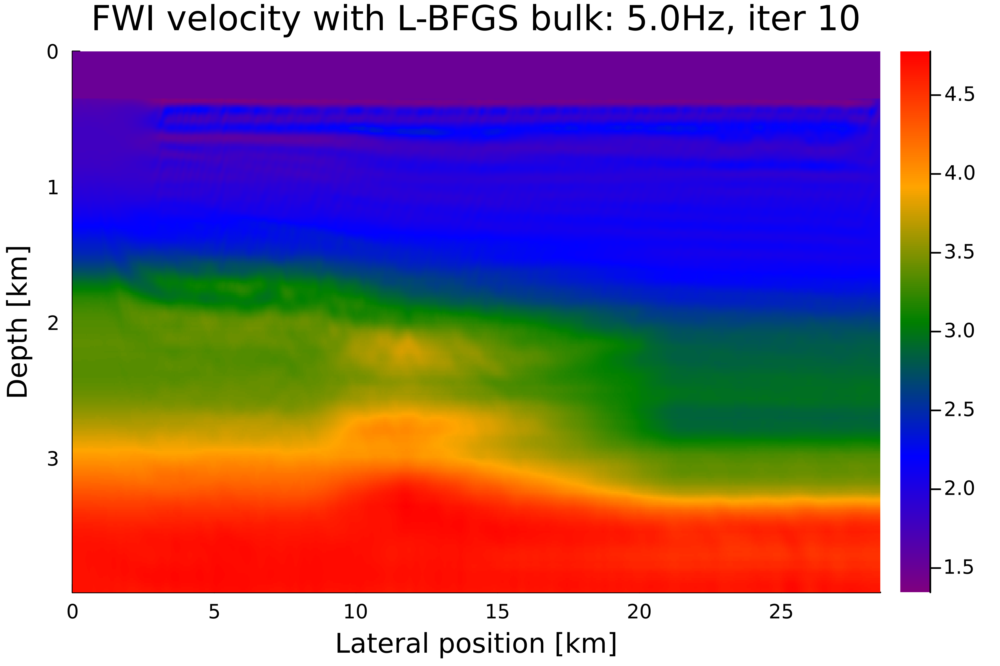
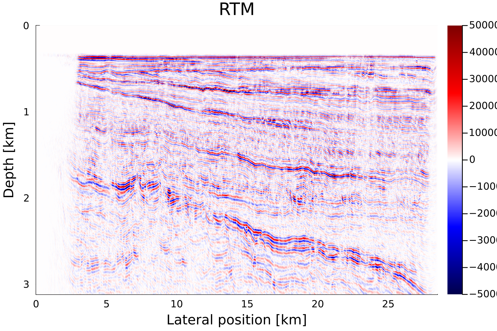
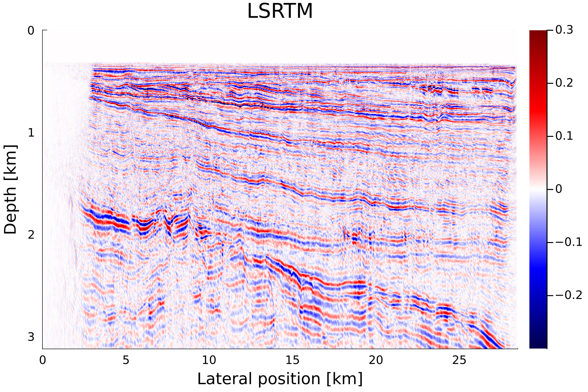

# Viking Graben Line 12


[Viking Graben Line 12](https://wiki.seg.org/wiki/Mobil_AVO_viking_graben_line_12) is an open source marine 2D seismic datasets.


## Dataset

To download the data use `download_data.sh` script (don't forget to make it executable `chmod +x download_data.sh`). It contains segy data, source signature, well logs and the description.

## Preprocessing

To preprocess the data [Madagascar](https://www.reproducibility.org/wiki/Main_Page) open source seismic processing software is required. The processing scripts are located in `proc` subfolder.

## Inversion

### Configuration

To initialize this project, go to the example directory (location of `Project.toml`) and run:

```bash

julia -e 'using Pkg;Pkg.add("DrWatson");Pkg.activate(".");Pkg.instantiate()'

```

this will install all required dependency at the version used to create these examples.

## FWI and RTM

After preprocessing is done FWI is the way to go. Inversion scripts is in `fwi` subfolder. Inversion/migration are done using [JUDI](https://github.com/slimgroup/JUDI.jl) interface.

The last steps are RTM and LSRTM wich are in `rtm` and `lsrtm` subfolders repectively.

Before runnig FWI/RTM be sure to preinstall julia dependencies: `julia requirements.jl`

To run FWI/RTM examples you will probably need to have 20-30 Gb RAM available.

Here are the results of FWI/RTM/LSRTM.







The example is provided by [Kerim Khemraev](https://github.com/kerim371)